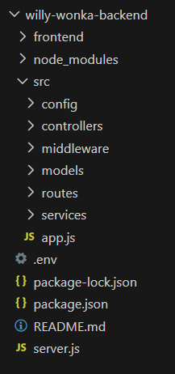
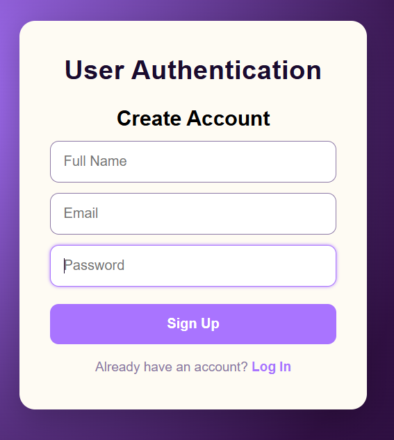
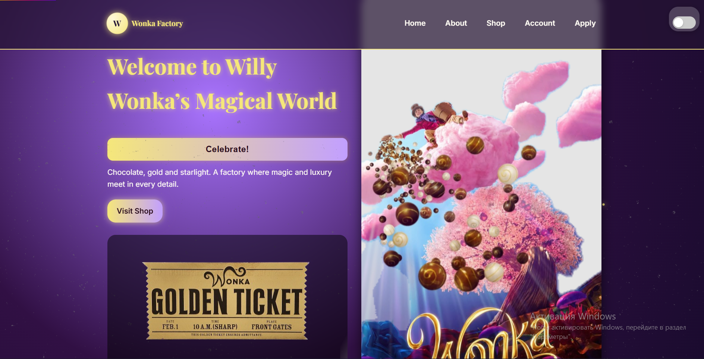
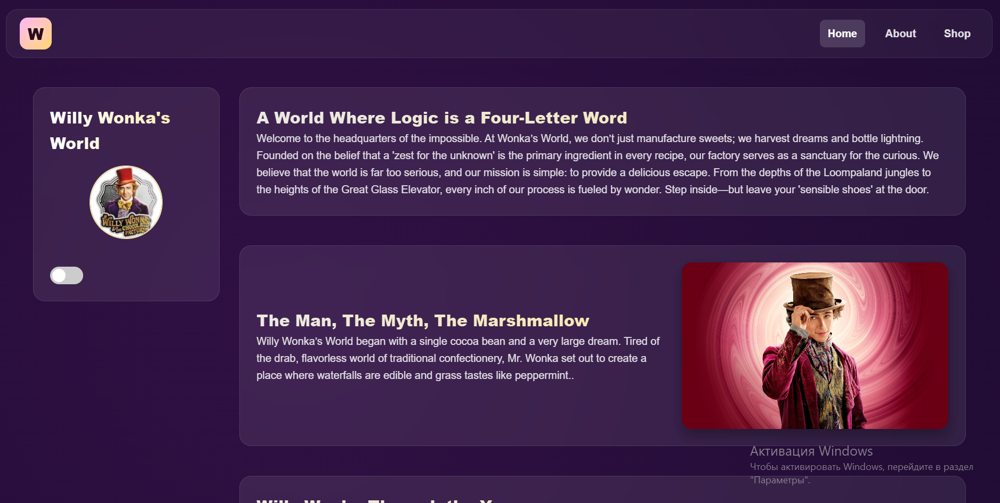
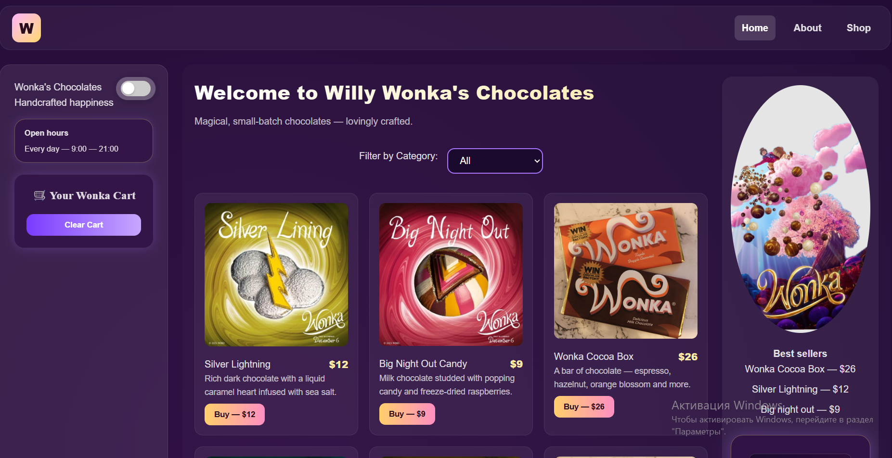
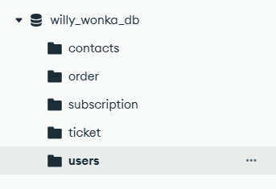

# Willy Wonka’s Magical Factory 

A fun interactive web application inspired by Willy Wonka — includes a shop, golden ticket registration, interactive experiences, and subscription forms. 
Built with HTML, CSS, JavaScript, Node.js, Express, and MongoDB.

## Project Structure 

## Setup Instructions

1Install dependencies: npm install

2.Create a .env file in the root:
PORT=5000
MONGO_URI=<mongodb_connection_string>

3.Run the server: node server.js

4.Open the app in browser: http://localhost:5000

## Project Overview

Homepage (willy.html): Interactive Willy Wonka experience with confetti, star ratings, random quotes, and gallery.

Shop (shop.html): Browse chocolate products, add to cart, and simulate order submission.

About (index1.html): Information about the factory, history, and visual highlights.

## API Documentation

All API endpoints are under /api.

### Auth

POST /api/auth/register — Register a new user

POST /api/auth/login — User login

### Tickets

POST /api/tickets — Submit Golden Ticket registration

### Orders

POST /api/orders — Submit a simulated order

### Subscription

POST /api/subscribe — Subscribe to newsletter

### Contact

POST /api/contact — Send a contact message

All POST requests accept JSON payloads. Responses are returned as JSON.

# Registration: 
## Allows users to create an account (Sign Up) or log in.Interacts with the backend auth API to save user info or verify credentials.

# Homepage:
## Landing page of Willy Wonka’s world. Shows interactive features:confetti celebration button, star rating system, random Wonka quotes.

# Aboutpage: 
## Provides information about Willy Wonka and the factory.

# Shoppage
## Displays products for sale (chocolates, candies, etc.).

# Mongo collection

# Notes

This project is a demo / educational purpose.
No real payments are processed; the shop is simulated.